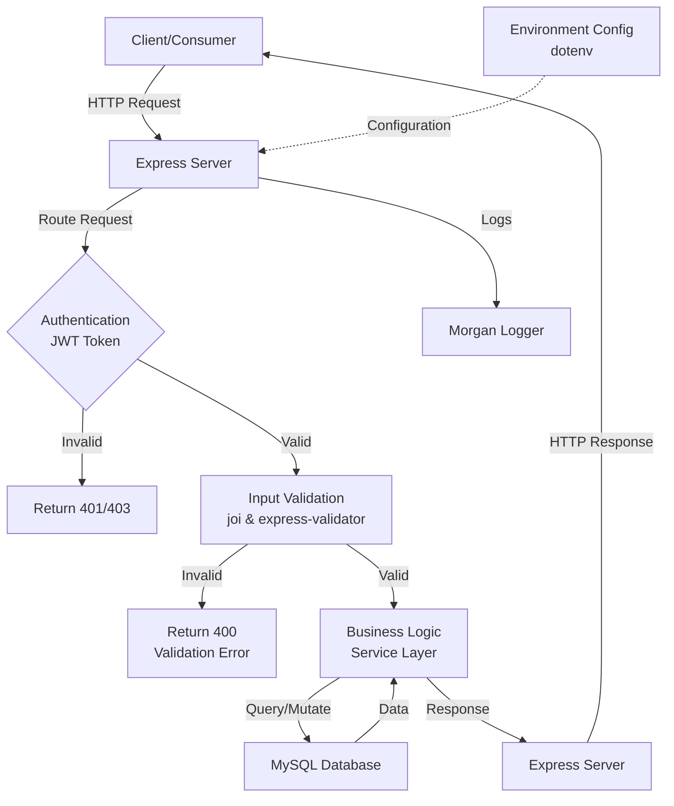

# Architecture Overview

This document describes the architecture for the TaskFlow Node.js Express API, including its key components and how they interact. The architecture features several important layers and technologies.

## Tech Stack
- **Runtime:** Node.js
- **Framework:** Express.js 5.2.1
- **Database:** MySQL 3.18.0
- **Authentication:** JWT (jsonwebtoken 9.0.3)
- **Password Security:** bcryptjs 3.0.3
- **Input Validation:** joi 18.0.2, express-validator 7.3.1
- **HTTP Logging:** Morgan 1.10.1
- **Environment:** dotenv 17.3.1

## Architecture Layers

### 1. Client Layer
- Frontend applications or external API consumers
- Sends HTTP requests to the API endpoints

### 2. API Gateway / Express Server
- Entry point for all client requests
- Routes requests to appropriate handlers
- Manages HTTP request/response lifecycle
- Implements Morgan for request logging

### 3. Authentication & Security Layer
- **JWT Authentication:** jsonwebtoken for token-based authentication
- **Password Encryption:** bcryptjs for secure password hashing
- Validates incoming tokens on protected routes

### 4. Validation Layer
- **joi:** Schema validation for request payloads
- **express-validator:** Field validation and sanitization
- Ensures data integrity and prevents invalid data from reaching business logic

### 5. Business Logic Layer
- src/server.js: Main server entry point
- Service layer for processing business logic
- Handles core application functionality

### 6. Database Layer
- MySQL database for persistent data storage
- mysql2 driver for database connectivity
- Manages CRUD operations and data queries

## System Flow Diagram



## Key Components

| Component | Purpose | Technology |
|-----------|---------|-----------|
| Authentication | Secure API access with JWT tokens | jsonwebtoken |
| Password Security | Encrypt user passwords | bcryptjs |
| Input Validation | Validate request data | joi, express-validator |
| HTTP Logging | Monitor API requests | Morgan |
| Configuration | Manage environment variables | dotenv |
| Database | Data persistence | MySQL, mysql2 |

## Development & Deployment Scripts

```json
{
  "dev": "nodemon src/server.js",    // Development with auto-reload
  "start": "node src/server.js"      // Production start
}
```

## Architecture Benefits

✅ **Security:** JWT authentication + password encryption  
✅ **Reliability:** Input validation prevents malformed data  
✅ **Observability:** Morgan logging for request tracking  
✅ **Scalability:** Modular layer architecture for easy expansion  
✅ **Maintainability:** Clear separation of concerns between layers  
✅ **Flexibility:** Environment-based configuration via dotenv