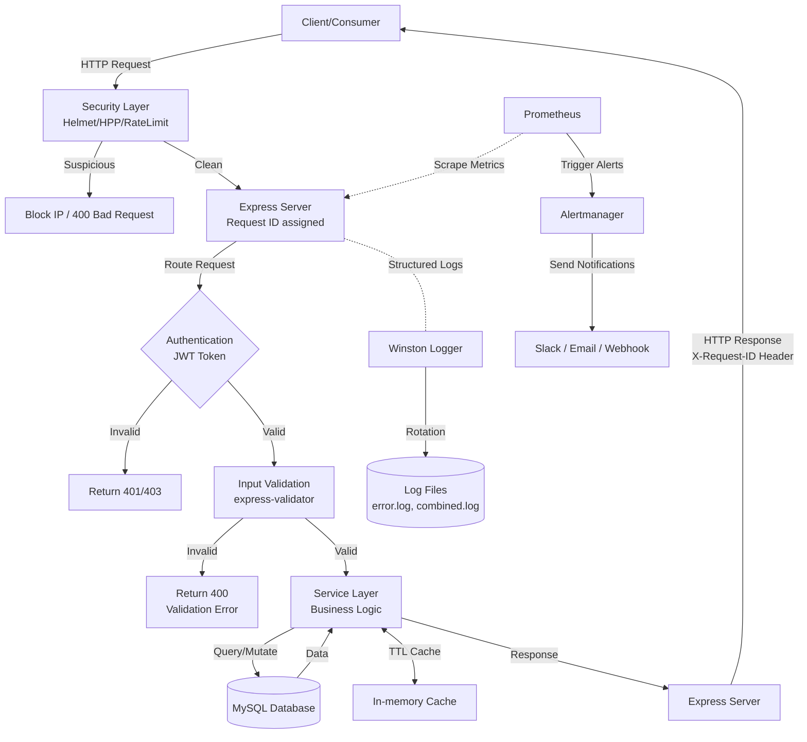

# Architecture Overview

This document describes the architecture for the TaskFlow Node.js Express API, including its key components and how they interact. The architecture features a layered design focused on security, observability, and testability.

## Tech Stack
- **Runtime:** Node.js
- **Framework:** Express.js 5.2.1
- **Database:** MySQL 3.18.0
- **Authentication:** JWT (jsonwebtoken 9.0.3)
- **Password Security:** bcryptjs 3.0.3
- **Input Validation:** joi 18.0.2, express-validator 7.3.1
- **HTTP Logging:** Morgan 1.10.1
- **Application Logging:** Winston 3.19.0
- **Testing:** Jest 30.3.0, Supertest 7.2.2
- **Security Middleware:** Helmet (Headers), HPP (Parameter Pollution), Express-Rate-Limit
- **Environment:** dotenv 17.3.1
- **Containerization:** Docker & Docker Compose

## Architecture Layers

### 1. Client Layer
- Frontend applications or external API consumers.
- Sends HTTP requests to the API endpoints.

### 2. Security Middleware Layer
- **Helmet:** Sets secure HTTP headers (XSS, Clickjacking protection).
- **HPP:** Protects against HTTP Parameter Pollution.
- **Rate Limiting:** Prevents DDoS and brute-force attacks.
- **Security Detector:** Custom utility that scans for SQL Injection and XSS patterns in real-time.
- **IP Blocking:** Automatically blocks suspicious IPs for 15 minutes after threshold violations.

### 3. API Gateway / Express Server
- Entry point for all client requests.
- Implements **Request ID Middleware** to assign unique UUIDs to every request for traceablity.
- Implements **Request Logger** (Winston-based) for structured traffic monitoring.

### 4. Authentication Layer
- **JWT Authentication:** Stateful token validation via `protect` middleware.
- **RBAC:** Role-based authorization via `restrictTo` middleware.

### 5. Validation Layer
- **express-validator:** Schema-based field validation and sanitization.
- Ensures data integrity before reaching the business logic.

### 6. Service Layer (Business Logic)
- **TaskService / OrderService:** Contains all core business logic and transaction management.
- Decoupled from controllers to ensure reusability and testability.
- Handles atomic database operations (Rollback/Commit).

### 7. Data Access Layer (Models)
- **MySQL Database:** Persistent storage.
- **Database Indexing:** Optimized for performance (User ID, Status, CreatedAt indexes).
- **Caching Layer:** In-memory TTL-based caching for frequent read operations.

### 8. Testing & QA Layer
- **Automated Tests:** Comprehensive unit and integration tests using **Jest**.
- **Mocking System:** Isolated tests using database mocks to ensure reliability without infrastructure dependencies.
- **Security Audit:** Automated verification of security filters and middleware.

### 9. Infrastructure Layer
- **Docker (Multi-Stage Build):** A two-stage build (`builder` → `production`) keeps the final image lean — only production code and `node_modules` are included. Base image is `node:18-alpine`.
- **Non-Root User:** The container runs as a dedicated `appuser:appgroup` (no UID 0), eliminating container-escape privilege vectors.
- **Read-Only Root Filesystem:** The container's root FS is mounted read-only; only `/tmp` and the `logs/` directory are writable via `tmpfs` mounts.
- **No New Privileges:** `security_opt: no-new-privileges:true` prevents the process from acquiring additional Linux capabilities at runtime.
- **Resource Limits:** Memory capped at 512 MB and CPU at 0.5 cores; prevents a single container from exhausting the host.
- **Docker Compose:** Orchestrates the `app` + `db` services on an isolated bridge network (`taskflow-network`).
- **Health Checks:** MySQL health check (`mysqladmin ping`) with `start_period: 30s` ensures the DB is ready before the API starts.

### 10. Monitoring and Notification Layer
- **Prometheus:** Scrapes metrics from the API and evaluates alerting rules.
- **Alertmanager:** Handles alerts sent by Prometheus, deduplicates and groups them, and routes them to configured receivers (e.g., Slack, Email, Webhooks).
- **Grafana:** Connects to Prometheus for live visualization of metrics and dashboards.

## System Flow Diagram



## Key Components

| Component | Purpose | Technology |
|-----------|---------|-----------|
| Security Hardening | Headers & Attack Prevention | Helmet, HPP, SecurityDetector |
| Authentication | Secure API access with JWT | jsonwebtoken |
| Service Layer | Decoupled Business Logic | Service Objects (task.service.js) |
| Performance | Optimized queries & caching | MySQL Indexes, In-memory Cache |
| Reliability | Comprehensive Testing | Jest, Supertest, Mocking |
| Traceability | End-to-end request tracking | UUID (X-Request-ID) |
| Containerization | Multi-stage build, Non-root user | Docker, Docker Compose |
| Container Security | Read-only FS, No new privileges, Resource limits | Docker security_opt, tmpfs, deploy.resources |

## Development & Deployment Scripts

```json
{
  "dev":            "nodemon src/server.js",               // Development with auto-reload
  "start":          "node src/server.js",                  // Production start
  "test":           "jest --config ...",                   // Automated test suite
  "test:coverage":  "jest ... --coverage",                 // Coverage report
  "docker:build":   "docker build -t taskflow-api:latest", // Build hardened image
  "docker:up":      "docker-compose up -d",               // Start all services
  "docker:down":    "docker-compose down",                // Stop all services
  "docker:logs":    "docker-compose logs -f app"          // Tail app logs
}
```

## Architecture Benefits

 **Security-First:** Multi-layer defense (Headers, Scanner, IP Blocking, RBAC)  
 **Container Security:** Non-root user · Read-only FS · No-new-privileges · Resource limits  
 **Minimal Attack Surface:** Alpine base image + production-only `node_modules` (161 MB image)  
 **Data Consistency:** Atomic transactions in service layer  
 **High Performance:** DB indexing and TTL caching  
 **Observability:** Request ID tracking + Structured Winston JSON logging  
 **Testability:** Mock-ready service architecture with >30 automated test cases  
 **Maintainability:** Strict separation between Routes, Controllers, Services, and Models